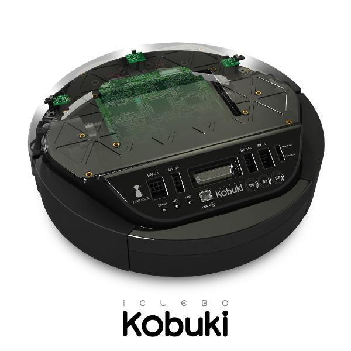

## Kobuki Robot

Kobuki Robot serial communication driver.



By default, UART2 is used for communication with Kobuki on RT-Thread (RTOS). 

The driver is mostly platform independent. Porting to a new platform only requires implementation of basic serial operations in `kobuki_serial.c`: 

```
int  kobuki_serial_init();
char kobuki_serial_read();
int  kobuki_serial_write(uint8_t* dat, int len);
int  kobuki_serial_write_char(uint8_t ch);
void kobuki_serial_close();
```

### Supported APIs

#### Initialization

```
void kobuki_init();
```

```
void kobuki_close();
```

#### Set speed

```
void kobuki_set_speed(double tv, double rv);
```

#### Control power supply

```
void kobuki_enalbe_3v3();
```

```
void kobuki_enable_5v();
```

```
void kobuki_enable_12v_5a();
```

```
void kobuki_enable_12v_1_5a();
```

#### Control GPIO

```
void kobuki_set_led1_red();
```

```
void kobuki_set_led1_green();
```

```
void kobuki_set_led2_red();
```

```
void kobuki_set_led2_green();
```

#### PID Controller

```
void kobuki_set_controller_gain(uint32_t kp, uint32_t ki, uint32_t kd);
```

```
void kobuki_get_controller_gain();
```

```
void kobuki_reset_controller_gain();
```

#### Play sound

```
void kobuki_play_sound(uint16_t note, uint8_t duration);
```

```
void kobuki_play_sound_on();
```

```
void kobuki_play_sound_off();
```

```
void kobuki_play_sound_recharge();
```

```
void kobuki_play_sound_button();
```

```
void kobuki_play_sound_error();
```

```
void kobuki_play_sound_cleaning_start();
```

```
void kobuki_play_sound_cleaning_end();
```

#### Version

```
void kobuki_get_hardware_version();
```

```
void kobuki_get_firmware_version();
```

```
void kobuki_get_uuid();
```
